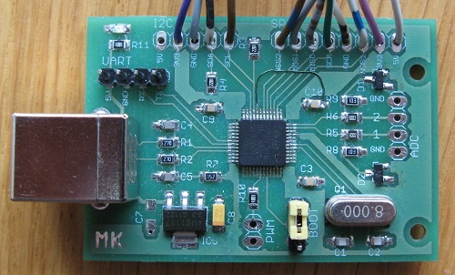
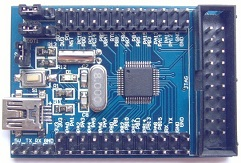
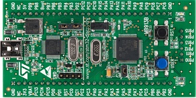
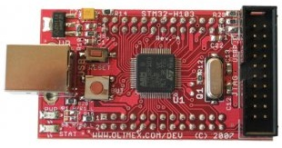
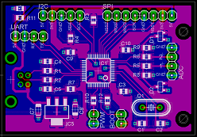
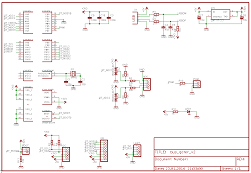

### Bus gofer

I've designed _Bus gofer_ to have easy access to the I2C and SPI busses from a computer. I use it mainly to program
EEPROM and flash devices I use in other projects, but communication with any I2C/SPI device is possible. Because the MCU
is quite powerful I felt it would be a waste to use it just for SPI and I2C access so I later added the PWM and ADC commands.
The name comes from the _bus pirate_ project since the area of application is similar.

The software was originally written for STM32F100 and communication with the MCU was done over USART1 with an external USB
to serial converter (many available cheaply from eBay). After I implemented USB CDC in my STM32F10x library,
the software was extended to STM32F103 and is now portable between both MCUs.

To compile the sources my STM32F10x library is required.

[](images/IMG_2182.jpg)

Although I've designed my own board for it (since I quite enjoy doing that), it can easily be used with any STM32F100 or
STM32F103 development boards out there such as:

* LC Technology STM32F103C8 (tested, 5 euro on eBay, search for STM32F103)
* STM32VLDISCOVERY from ST (tested, available from big distributors like Farnell, Mouser, Digikey, etc.)
* Olimex STM32-H103 (untested)
* and others





I recommend a F103 board instead of F100 since a USB to serial converter is not needed and the communication is faster. Basically
the only thing my custom board has and generic development boards lack is I2C pull-up resistors and the 1:4 resistor divider I've
added to the ADC inputs to be able to measure automotive voltages (12V).

The device is driven by AT commands. Successful command execution returns OK, unsuccessful returns ERR.

#### General commands

Command | Description
--------|-------------
AT | Returns OK.
ATE0/1 | Echo on or off. On power up, echo is off.
ATI | Returns ID string.
AT? | Prints a list of supported AT commands.
AT+IPR=br | When using serial interface (F100) set the baud rate. Not available when using USB CDC for comm (F103). Baud rate must be a multiple of 9600.

#### Buffer commands

All interface write operations use data in the write buffer as a data source. All read operations store read data in the read buffer.
Both buffers are 256 bytes.

Command | Description
--------|-------------
AT+BUFWR=dddddd... | Store data in the write buffer. Each byte should be represented by two hex digits, i.e. 08, 1A, F3, etc. without any separators.
AT+BUFRD | Display read buffer.
AT+BUFRDLEN | Display read buffer length.
AT+BUFSWAP | Swap read and write buffers.
AT+BUFCMP | Compare read and write buffers. The command will return ERR if either the lengths or the contents of the buffers don't match.
AT+BUFRDDISP=1/0/? | Turn automatic displaying of the read buffer after read commands on or off. On power up, BUFRRDDISP is 1.

The buffer system is the core of how device comm is designed. Here are a few examples to make understanding it easier.

__To write to a device:__

1. Use BUFWR to fill the write buffer.
2. Use one of the write commands.
3. Optionally, to verify, read the data back from the device (read buffer gets filled).

You can speed up the verify procedure by having the MCU do it for you. To do this, switch off the automatic read buffer displaying
using BUFRDDISP=0. Step 3 will now read the device as before (read buffer gets filled), but the read buffer will not be displayed anymore.
To compare if buffers match, issue BUFCMP as step 4.

__To read from a device:__

1. Use one of the read commands.
2. If BUFRDDISP is 1, the read buffer is displayed immediately.
3. If BUFRDDISP is 0, the contents of the read buffer can be viewed by issuing BUFRD.

__To quickly clone a device:__

1. Connect both source and destination device.
2. If using I2C devices, configure them to use different I2C addresses.
3. If using SPI devices, use one of the two available NSS pins for the source and the other for the destination device.
4. Turn off read buffer displaying with BUFRDDISP=0.
5. Select the source device. If using I2C, set the address of the source device using I2CADR=aa. If using SPI, select the NSS pin used by the device by issuing SPIDEV=n.
6. Use one of the read commands to read data from the source device into the read buffer.
7. Swap the read and write buffers using BUFSWAP.
8. Select the destination device. If using I2C, set the address of the destination device using I2CADR=bb. If using SPI, select the NSS pin used by the device by issuing SPIDEV=k.
9. Use one of the write commands to write data to the destinations device.
10. Optionally verify the write.
11. Repeat from step 5.

#### Generic I2C commands

Command | Description
--------|-------------
AT+I2CADR=aa | Set I2C address to hex address aa.
AT+I2CWR | Write data from the write buffer to I2C address set by I2CADR.
AT+I2CRD=len | Read decimal len bytes from I2C address set by I2CADR.

#### Generic SPI commands

Command | Description
--------|-------------
AT+SPIRW | Writes data from the write buffer and fills the read buffer at the same time.
AT+SPIDEV=1/2/? | Select which one of the two NSS pins will be used.

#### I2C EEPROM 24 commands

These are specialized functions for reading/writing to 24CXXX I2C EEPROM devices (developed for and tested on 24LC256).

Command | Description
--------|-------------
AT+EE24RD=aaaaaa,len | Read len bytes from hex address aaaaaa into the read buffer. Address must be exactly 6 characters long (24 bit).
AT+EE24WR=aaaaaa | Program write buffer to hex address aaaaaa.
AT+EE24MD5=len | Calculate MD5 from address 0 to len-1

#### SPI flash 25 commands

These are specialized functions for reading/writing to XX25 SPI flash devices (developed for and tested on Spansion S25FL208).

Command | Description
--------|-------------
AT+FLS25RD=aaaaaa,len | Read len bytes from hex address aaaaaa into the read buffer. Address must be exactly 6 characters long (24 bit).
AT+FLS25WR=aaaaaa | Program write buffer to hex address aaaaaa.
AT+FLS25CE | Execute chip erase instruction. Note that the chip erase may take several seconds to complete (check part data sheet) and the device will not return OK until the erase cycle is complete.
AT+FLS25ID | Read 3 byte flash JEDEC ID.
AT+FLS25MD5=len | Calculate MD5 from address 0 to len-1

#### SPI EEPROM 95 commands

These are specialized functions for reading/writing to XX95 SPI EEPROM devices (developed for and tested on ST95P08).

Command | Description
--------|-------------
AT+EE95RD=aaaaaa,len | Read len bytes from hex address aaaaaa into the read buffer. Address must be exactly 6 characters long (24 bit).
AT+EE95WR=aaaaaa | Program write buffer to hex address aaaaaa.
AT+EE95MD5=len | Calculate MD5 from address 0 to len-1

You might have noticed that the specialized EEPROM / flash device commands include a MD5 sum command.
This is to provide a secondary method of verification. Instead of reading back and verifying each write operation,
the programming application can instead calculate the MD5 of programming data and ask the MCU to do the same calculation
on the device data. If the MD5 sums match... The python script prg.py described below uses this approach.

#### PWM commands

Outputs a PWM signal on PB6 with selectable frequency and duty cycle.

Command | Description
--------|-------------
AT+PWMF=freq | Frequency in Hz. Min 1, max 1000000.
AT+PWMDC=percent | Duty cycle in percent. Min 1, max 99.

#### ADC commands

Any combination of 16 channels of ADC1 on the device can be sampled.

Command | Description
--------|-------------
AT+ADCSTART=cccc,msec | Start acquiring on channels cccc (hex bitmask) with msec delay between samples. Min msec 1, max 10000.

Example:

To sample channel 0, the corresponding bitmask would be 0001.

To sample channel 1, the corresponding bitmask would be 0002.

To sample channels 0 and 1, the corresponding bitmask would be 0003.

And so on...

The output format is compatible with the serial oscilloscope application by x-io technologies.

```
AT+ADCSTART=0003,200

2,17

2,17

2,18
```

etc.

Samples are in decimal format, all channels in a single line, lowest to highest channel, separated by commas.
A new line means next sample values. A new line is printed every msec, in this case 200ms. Sample values are
raw ADC values, lowest possible value is 0, highest is 4095 (12 bits).

Samples are output continuously until an uppercase X is received. During this time AT commands are not processed.

#### Pin mapping

The device uses MCU's I2C_2 and SPI_1 interfaces.

Function | Pin
---------|----
I2C SDA | PB11
I2C SCL | PB10
SPI SCK | PA5
SPI MISO | PA6
SPI MOSI | PA7
SPI NSS1 | PA4
SPI NSS2 | PB0
PWM out | PB6

#### Bill of materials

[](images/bus_gofer_brd.png)
[](images/bus_gofer_sch.png)

Qty | Value / Farnell code | Device | Size | Parts
----|----------------------|--------|------|------
1 | 1899017 | STM32F103    | LQFP48 | IC1
1 | 1202826 | LM1117-3.3   | SOT223 | IC5
2 | 2317418 | BAS40-04     | SOT-23 | D1, D2
1 | 8 MHz   | crystal      | HC49   | Q1
1 | green   | chipled      | 0805   | LED1
2 | 27R     | resistor     | 0805   | R1, R2
2 | 1k      | resistor     | 0805   | R10, R11
1 | 1k5     | resistor     | 0805   | R7
2 | 2k      | resistor     | 0805   | R3, R4
3 | 10k     | resistor     | 0805   | R8, R9, R12
2 | 30k     | resistor     | 0805   | R5, R6
2 | 22p     | multilayer   | 0805   | C1, C2
2 | 47p     | multilayer   | 0805   | C4, C5
3 | 100n    | multilayer   | 0805   | C3, C9, C10
2 | 10u     | tantalum     | 1206   | C7, C8
1 |         | USB B con.   |        | X1
